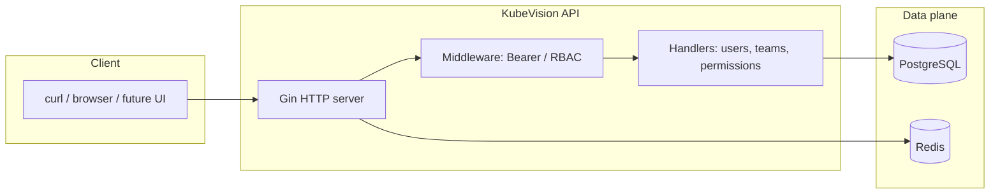

# KubeVision — Engineering Documentation

**Audience:** engineers onboarding to the repo, operators running the API locally, and contributors extending the backend.  
**Scope:** everything implemented **to date** (Phase 1 platform + Phase 2 identity & RBAC APIs). The full product vision lives in [KUBEVISION_PROJECT.md](./KUBEVISION_PROJECT.md).

---

## 1. Why this project exists

**Problem:** Platform teams need a single place to observe and manage Kubernetes clusters, charts, and alerts—without stitching together five different tools.

**What we are building:** **KubeVision**, a self-hosted control plane with a Go API (today), later a React dashboard, Helm integration, and observability stack.

**Why document this way:** Large engineering orgs separate *vision* (PRD/spec) from *runbooks* (how to run and extend what shipped). This file is the runbook for **what is in `main` right now**.

---

## 2. High-level architecture (as implemented)



| Layer | Responsibility |
|--------|----------------|
| **Gin** | HTTP routing, JSON, timeouts, `/metrics` for Prometheus-style scraping. |
| **Postgres** | Source of truth for users, teams, RBAC rows, registered clusters (metadata + kubeconfig blob). |
| **Redis** | Reserved for sessions, caching, rate limits (wired in Phase 1; full use in later phases). |
| **Embedded SQL migrations** | Repeatable schema on startup—no separate migration CLI required for local dev. |

---

## 3. Prerequisites

| Requirement | Why |
|-------------|-----|
| **Go 1.22+** | Module and dependencies are pinned for 1.22; CI and local dev stay aligned. |
| **Docker** | Postgres and Redis run in containers so every developer gets the same datastore without local installs. |
| **Git** | Clone, branch, and follow [CURSOR_GIT_WORKFLOW.md](./CURSOR_GIT_WORKFLOW.md) if you use Cursor-driven commits. |

---

## 4. Phase 1 — Platform foundation

### 4.1 What shipped

- **HTTP API** (`cmd/server/main.go`): process start, DB/Redis connect, migrations, cluster manager load, metrics collector goroutine, graceful shutdown.
- **Public routes (no auth):** `GET /`, `GET /healthz`, `GET /readyz`, `GET /metrics`, `GET /api/v1/version`, `GET /api/v1/clusters`.
- **Postgres access:** `internal/db/postgres.go`, `internal/db/redis.go`, `internal/db/migrate.go` + `internal/db/migrations/*.sql`.
- **Kubernetes client manager:** `internal/k8s/client.go` — loads cluster kubeconfigs from DB into in-memory clients (empty until you insert rows).
- **Makefile & scripts:** `make deps-up` / `deps-down` use `scripts/deps-up.sh` (Docker `run`/`start`) for hosts without Docker Compose v2.

### 4.2 Why each piece exists

| Piece | Why |
|-------|-----|
| **`/healthz`** | Orchestrators (K8s liveness) need a cheap “process up” signal. |
| **`/readyz`** | Readiness must fail if Postgres or Redis is down so traffic is not routed to a broken instance. |
| **`/metrics`** | Standard hook for Prometheus; future SLO dashboards depend on it. |
| **Migrations on boot** | Local and single-binary deploys stay simple; schema always matches the binary you run. |
| **Cluster manager from DB** | Multi-cluster is a first-class product requirement; storing encrypted kubeconfigs in DB is the documented direction. |

### 4.3 Step-by-step: run Phase 1 locally

**Step 1 — Clone and enter the repo**

```bash
git clone git@github.com:AbhishekSharmaIE/Kubevision.git
cd Kubevision
```

*Why:* Ensures you are on the same module path (`github.com/AbhishekSharmaIE/Kubevision`) the code imports use.

---

**Step 2 — Start Postgres and Redis**

```bash
make deps-up
```

*What it does:* Starts (or restarts) containers `kubevision-pg` and `kubevision-redis` with credentials matching `.env.example`.

*Why:* The API **panics on startup** if it cannot ping Postgres/Redis—fail-fast avoids serving half-broken requests.

*Alternative:* If you have Docker Compose v2:

```bash
docker compose -f deploy/docker-compose.deps.yml up -d
```

---

**Step 3 — Environment (optional but recommended)**

```bash
cp .env.example .env
```

*Why:* Centralizes `DATABASE_URL`, `REDIS_URL`, `PORT`, `LOG_LEVEL`. Defaults already match `deps-up` if you skip this.

---

**Step 4 — Run the server**

```bash
make run-dev
```

*Why `run-dev`:* Fast iteration via `go run` without installing to `bin/` first.

*Production-style binary:*

```bash
make build
./bin/kubevision
```

---

**Step 5 — Verify Phase 1 behavior**

```bash
# Liveness — should always return 200 if process is up
curl -sS http://127.0.0.1:8080/healthz

# Readiness — 200 only if Postgres + Redis accept connections
curl -sS http://127.0.0.1:8080/readyz

# API version
curl -sS http://127.0.0.1:8080/api/v1/version

# Clusters currently registered in memory (empty until DB rows + valid kubeconfigs)
curl -sS http://127.0.0.1:8080/api/v1/clusters
```

*Why these curls:* They prove the process, datastore connectivity, and router wiring without needing auth.

---

**Step 6 — Stop dependencies (when done)**

```bash
make deps-down
```

*Why:* Frees ports `5432` and `6379` for other projects.

---

## 5. Phase 2 — Users, teams, and RBAC

### 5.1 Security model (interim, explicit)

We **have not** shipped JWT login yet. Identity today is:

```http
Authorization: Bearer <user-uuid>
```

where `<user-uuid>` is the primary key of a row in `users`.

| Design choice | Why |
|---------------|-----|
| **Bearer = user id** | Unblocks RBAC and CRUD without building login, refresh tokens, and session tables first. |
| **Bootstrap first user without token** | Someone must create the initial admin when the database is empty—classic “first run” problem. |
| **Passwords hashed with bcrypt** | Stored as `password_hash`; ready for a future `POST /auth/login` without schema churn. |

**Operational note:** Treat bearer UUIDs like secrets in shared environments until JWT + short-lived tokens land.

---

### 5.2 RBAC data model

Tables (from migrations) relevant to Phase 2:

| Table | Role |
|-------|------|
| `users` | People; `is_admin` bypasses team-scoped checks. |
| `teams` | Groups of users. |
| `team_members` | `(team_id, user_id, role)` membership. |
| `cluster_permissions` | `(team_id, cluster_id, namespace, permission)` where `permission ∈ {read, write, admin}`. |
| `clusters` | Registered clusters (kubeconfig, etc.) — `cluster_id` in permissions is a **string** matching the cluster row’s id (as text). |

**Permission ranking:** `read` &lt; `write` &lt; `admin`. Evaluation is in `internal/rbac/eval.go`.

**Namespace matching:** A permission row applies if `namespace` equals the requested namespace **or** is `*` (all namespaces).

---

### 5.3 Step-by-step: exercise Phase 2 APIs

Assume server is running (`make run-dev`) and DB is empty or you know your user id.

---

**Step A — Bootstrap the first admin (empty `users` table only)**

```bash
curl -sS -X POST http://127.0.0.1:8080/api/v1/users \
  -H 'Content-Type: application/json' \
  -d '{
    "email": "admin@example.com",
    "name": "Admin User",
    "password": "changeme12",
    "isAdmin": true
  }'
```

*Why no `Authorization` header:* The handler allows the **first** user to be created without prior identity—otherwise you would need a database seed script out-of-band.

*Response:* JSON `data` includes `id` (uuid). **Save this uuid** — it is your bearer token for subsequent calls.

---

**Step B — Call an authenticated endpoint**

Replace `YOUR_USER_ID` with the uuid from Step A.

```bash
curl -sS http://127.0.0.1:8080/api/v1/teams \
  -H "Authorization: Bearer YOUR_USER_ID"
```

*Why:* Proves `BearerUser` middleware and Postgres round-trip.

---

**Step C — Create a team (admin only)**

```bash
curl -sS -X POST http://127.0.0.1:8080/api/v1/teams \
  -H "Authorization: Bearer YOUR_USER_ID" \
  -H 'Content-Type: application/json' \
  -d '{"name":"platform","description":"Platform engineering"}'
```

*Why:* Teams are the anchor for all namespace/cluster permissions.

---

**Step D — Grant a permission (admin)**

You need a `teamId` (uuid from Step C) and a `clusterId` string that matches a cluster registered in `clusters.id` (as text) when you start using real clusters. For a **dry run** you can use any string consistent with what you will store in DB.

```bash
curl -sS -X POST http://127.0.0.1:8080/api/v1/permissions \
  -H "Authorization: Bearer YOUR_USER_ID" \
  -H 'Content-Type: application/json' \
  -d '{
    "teamId": "TEAM_UUID",
    "clusterId": "CLUSTER_UUID_AS_STRING",
    "namespace": "default",
    "permission": "read"
  }'
```

*Why:* This row is what `RequireClusterPermission` and `GET /permissions/check` consult.

---

**Step E — Check effective permission**

```bash
curl -sS "http://127.0.0.1:8080/api/v1/permissions/check?cluster_id=CLUSTER_UUID_AS_STRING&namespace=default&permission=read" \
  -H "Authorization: Bearer MEMBER_USER_ID"
```

*Why:* Lets UIs and automation ask “can this user do X?” without duplicating SQL.

---

**Step F — Example enforced HTTP route**

```bash
curl -sS "http://127.0.0.1:8080/api/v1/rbac/probe/CLUSTER_UUID_AS_STRING/default" \
  -H "Authorization: Bearer MEMBER_USER_ID"
```

*Why:* Demonstrates **middleware-level** enforcement—the same pattern future `GET /clusters/:id/...` routes will use.

---

### 5.4 Phase 2 route map (quick reference)

| Area | Pattern | Auth |
|------|---------|------|
| Users | `POST /api/v1/users` | Optional bearer; first user unauthenticated |
| Users | `GET /api/v1/users`, `DELETE /api/v1/users/:id` | Admin + bearer |
| Users | `GET/PUT /api/v1/users/:id` | Self or admin |
| Teams | `GET /api/v1/teams`, `GET /api/v1/teams/:id`, members list | Member of team or admin |
| Teams | Mutations | Admin |
| Permissions | List / get / check | Scoped to user’s teams unless admin |
| Permissions | Create / update / delete | Admin |
| RBAC probe | `GET .../rbac/probe/:cluster_id/:namespace` | Bearer + `read` on namespace |

Exact registration order lives in `internal/api/register_phase2.go` to avoid Gin path shadowing (`/permissions/check` before `/permissions/:id`, `/teams/:id/members` before `/teams/:id`).

---

## 6. Environment variables

| Variable | Purpose |
|----------|---------|
| `DATABASE_URL` | Postgres DSN (default matches docker script). |
| `REDIS_URL` | Redis URL. |
| `PORT` | HTTP listen port (default `8080`). |
| `LOG_LEVEL` | Set to `debug` for verbose logs. |
| `JWT_SECRET` | Reserved for future JWT phase. |

Full list: [.env.example](./.env.example).

---

## 7. Testing and quality

```bash
# All Go tests (includes rbac unit tests)
go test ./...

# With race detector and coverage (Makefile)
make test
```

*Why:* Phase 2 added `internal/rbac/eval_test.go`; expand tests per package as handlers grow.

---

## 8. Troubleshooting

| Symptom | Likely cause | What to do |
|---------|----------------|------------|
| Process exits immediately on start | Postgres/Redis not reachable | Run `make deps-up`, check `docker ps`. |
| `readyz` returns 503 | DB or Redis down | Same as above; read JSON body for which dependency failed. |
| `401` on Phase 2 routes | Missing or invalid `Authorization: Bearer <uuid>` | Bootstrap user or fix uuid. |
| `403` on admin routes | User exists but `is_admin = false` | Update user in DB or use admin bearer. |
| `409` on create user | Duplicate email | Use a new email or update existing user. |
| Migrations idempotent errors | Rare with `IF NOT EXISTS` | If you hand-edit schema, align with `internal/db/migrations/*.sql`. |

---

## 9. What is intentionally not built yet

- JWT **login / refresh / logout** endpoints
- React dashboard
- Helm chart deploy of the app (chart scaffolding may exist in repo layout; full chart is roadmap)
- WebSocket metrics stream, AI log analysis, full cluster CRUD via API

Use [KUBEVISION_PROJECT.md](./KUBEVISION_PROJECT.md) for the phased plan and [CURSOR_GIT_WORKFLOW.md](./CURSOR_GIT_WORKFLOW.md) for AI-assisted commit discipline.

---

## 10. Document history

| Date | Change |
|------|--------|
| 2026-03-27 | Initial Documentation.md covering Phase 1 + Phase 2 as implemented. |

---

*Questions or gaps:* open an issue or extend this file in the same sectioned style when new phases ship.
